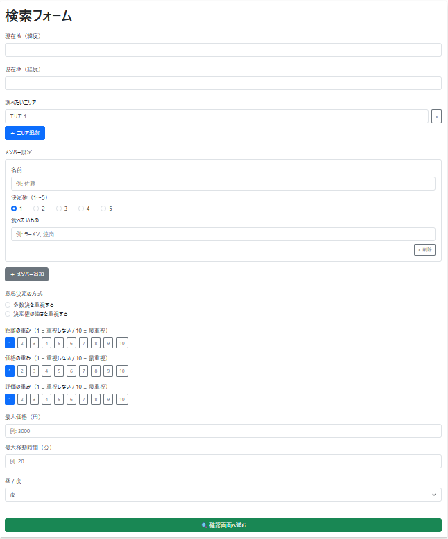
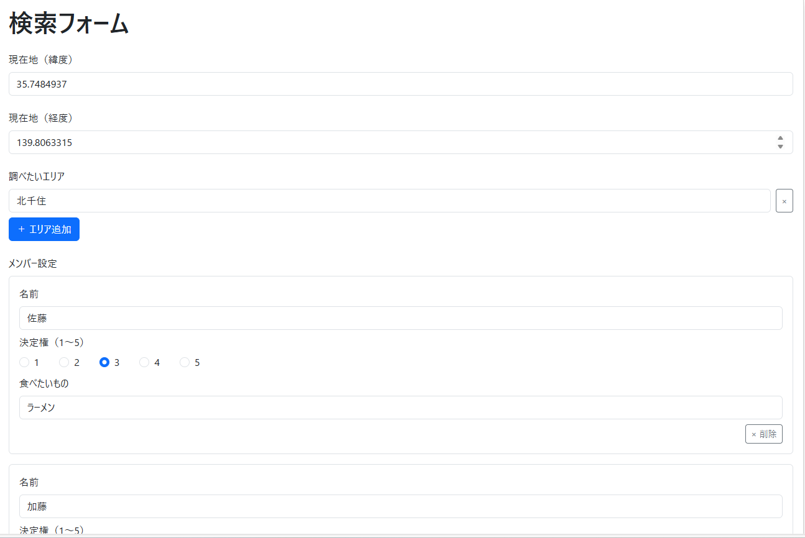
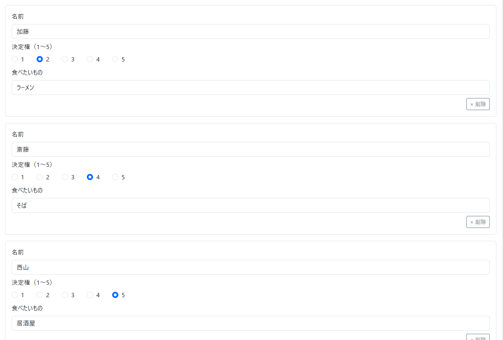
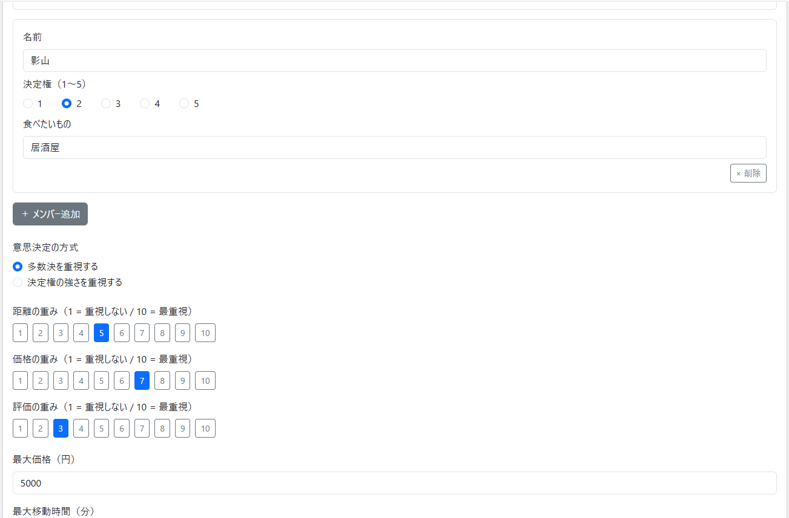
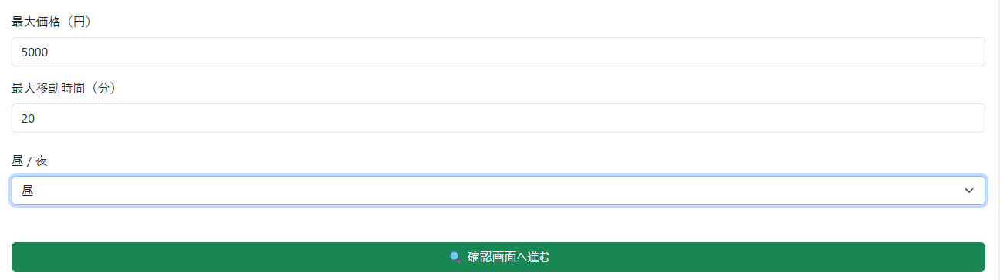
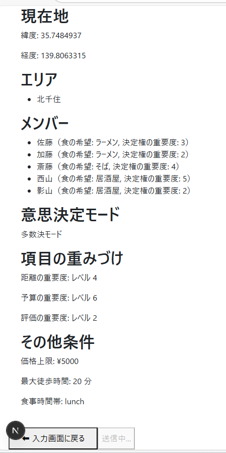
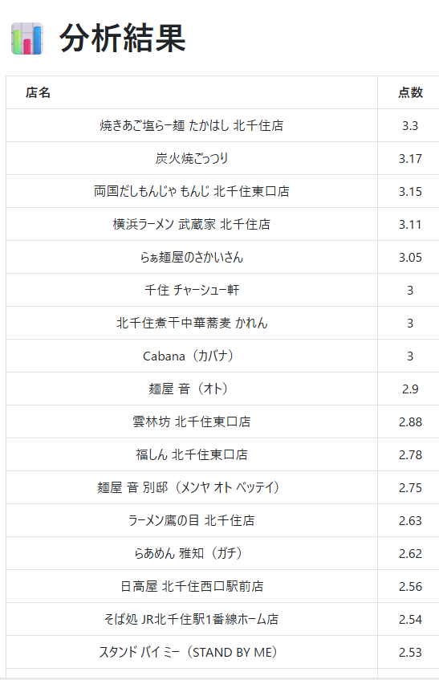
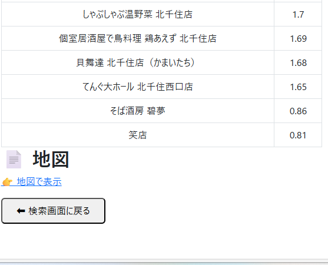
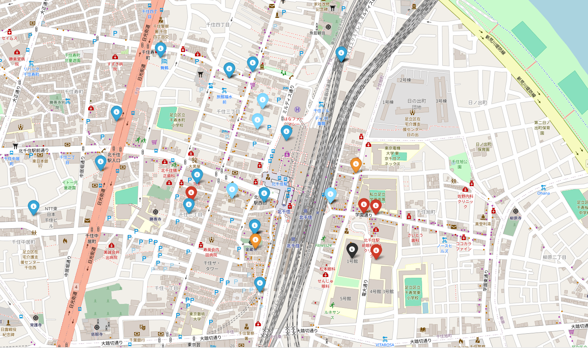

# Tabelog Web Project

## プロジェクト概要

Tabelog の飲食店データをもとに、グループ内での最適なお店選びを支援する Web アプリケーションの開発を目的としています。

## プロジェクトの背景・目的

普段利用していた Tabelog において、グループでお店を選ぶ際に「評価順」だけでは最適な選択ができないことに疑問を持ったことが、本プロジェクトの出発点です。
実際には、移動距離が長すぎる、価格が学生には高すぎるといった問題があり、グループのシチュエーションに応じた選択肢が提示されない点が課題だと感じました。

## アルゴリズムの考え方

グループ全体としてのお店の最適化を考えたとき<br>
意思決定に何が大きく影響しているか考えた。

### 分析
 グループの違いを<br>
「特徴」と「状況」に分けて整理した。

　(1)特徴→財力、体力、人数、好み<br>
　(2)状況→誕生日や接待、騒ぎたい・静かにしたい、早く決めたいかどうか<br>

これらを整理すると、  
多くのケースにおいて集団での意思決定を左右している要素は、
- 評価  
- 距離  
- 価格  
- 食べ物の好み（およびその好みを持つ人数）
  の4項目に集約できると考えられた。

### 具体的な解決策
 ただグループごとの特徴や状況によってはそれぞれの項目の重要度は異なる<br>
 →これに合わせるために「それぞれの項目の重要度」に重みづけを
  行えるようにした

  食べ物の好みに関しては多数決で行う場合が最適である状況<br>
  →単に食べ物の項目に点数をつける

  誰かを祝うときなどの状況ではその食べ物の項目がより重視される<br>
  →食べ物の項目にプラスか点をつける

  ことで対応させている。
  
  以上で各項目のデータ加工、標準化を行うことで最終的な点数をつける

---

## 主な使用技術

- **フロントエンド**：Next.js, typeScript 
- **バックエンド**：Django, python
- **データベース**：MySQL  
- **インフラ**：Docker / Docker Compose  
- **スクレイピング**：Selenium

---

## 使い方 how to Use

#### シチュエーション例：
グループの状況として、時間帯はお昼、現在地は東京電機大学。若い子が多く、現在地から探索するエリアは北千住駅。移動距離に関しては遠くまで行ける体力がありそう。しかし金銭的な余裕がない子が多い印象。ただ話すことが目的なので食べ物のおいしさとかはある程度無視できる。今回は誰かの誕生日とかではなくて多数決で食べたいものを決める。合計5人で食べたいものが[ラーメン、ラーメン、そば、居酒屋、居酒屋]である。最大で支払える額が大体5000円、歩く距離の上限が徒歩で20分。という状況を仮定。


### 入力方法（ステップ）

1. アプリにアクセス
2. 以下のように条件を入力：

   - **現在地**：緯度・経度入力
   - **検索するエリア(駅名)**: 北千住
   - **重視する項目**：
     - 価格：7（高）
     - 距離：5（中）
     - 評価：3（低）
   - **意思決定スタイル**：多数決
   - **メンバーの希望**：`['ラーメン', 'ラーメン', 'そば', '居酒屋', '居酒屋', 'ラーメン']`

3. 「検索」ボタンをクリック
4. 条件に合致した飲食店候補が表示されます
5. 店名をクリックすると、詳細情報や地図が確認できます


## 🧭 使用したときのシステムの動き

### トップページ


#### 入力例





---

### 入力確認ページ


---

### 処理中のDockerの様子


---

### 検索結果ページ




## セットアップ手順（Docker）

### 🔧 前提条件

- Docker / Docker Desktop のインストールが必要です  
  → [Docker Desktop ダウンロード](https://www.docker.com/products/docker-desktop)

### 🚀 起動手順

```bash
# 初回のみ：イメージのビルド
docker-compose build

# コンテナの起動
docker-compose up

#フロントエンドにアクセス
http://localhost:3000

```


## コンテナ関連のエラー
### エラーでつまずいたところ①

コンテナを起動する際にDBコンテナが起動する前にBackendコンテナが起動してしまう  
ことでBackendでエラーが起きた  
→対処方法 docker-compose.yml で DB が起動してから Backend コンテナを起動するように設定でクリア

---

### エラーでつまずいたところ②

コンテナは起動できたが、VScodeでコンテナを開く際は .devcontainer の設定を行う必要があった。  
作成したはずの /app（ワークスペース）がないと怒られたので .devcontainer の書き方を記事で読んで応用させた。  
.devcontainer 内で workspace を明示させてエラー処理した。

以下が参考記事  
→ https://qiita.com/1mono2/items/5bbf91f588ab9d5cd444

---

### エラーでつまずいたところ③

front のコンテナが VScode で開けなかった。  
→ 問題点は node_module の容量が大きすぎて front を docker で開く際のタイムアウトに引っかかった。  
.dockerignore ファイルを作成し、重いモジュールは無視することにした。

---

### container の問題はおおむね解決した

作業をするときは必ずコンテナに入ってから行う。  
docker-compose.yml がある場所で `docker-compose up` ですべてのコンテナを起動。  
`docker-compose exec backend bash` で backend や frontend のコンテナに移動してから  
`python manage.py` などのコマンドを入力する。  

backend のみの起動だと Docker ネットワークの db と backend のネットワークが切れてしまうため。

---

## スクレイピング関連のエラー

### エラーでつまずいたところ④

selenium のセッションエラー

#### (1)エラー個所の特定・検証
エラー文よりchrome と chromedriver のバージョンの不一致

原因:  
最新バージョンを自動で取得しようとすると、自動的にバージョン 144.~ がインストールされる。  
しかし、chrome のバージョンが 122.~ なので一致しないことによるエラー。

#### (2)エラーの解消・検証
バックエンドの Dockerfile より RUN コマンドから手動で 122.~ の chromedriver をインストールすることで対策。
  →無事セッションエラーは解決された

---

### エラーでつまずいたところ⑤

API を叩いた時の画面上に出てきたエラー文の内容:

KeyError at /api/tabelog/run/
['住所']

kotlin
コードをコピーする

→ 本質的なエラーではなく、副次的に起きたエラーである。


#### (1)エラー個所の特定・検証
data を確認したところ、Selenium で店舗情報が取得できない。


エラーした csv ファイル:
```
星5段階評価,
3.34,Non-Info
3.28,Non-Info
3.26,Non-Info
3.45,Non-Info
3.14,Non-Info
3.21,Non-Info
```
---
##### エラーの個所の特定

- selenium は起動している  
　→ 設定には誤りはない、バージョンのエラーは解決できている  
- URL の取得はできてる  
- 一店舗ごとの URL ページの遷移はできてる  
- 1 店舗の星五段階評価は取得できているが店舗情報の取得に失敗している？  
　仮説として、要素を取り出す前に次のページに遷移している？  
　→ タイムアウトになれば  
　　`print(f"要素が見つかりませんでした: {value}")`  
　　が表示されるはず → 問題なかった

---

##### エラー個所の特定の検証

```
tabelog-backend | 店舗基本情報を見つけることに成功
tabelog-backend | 星5段階情報取得成功
tabelog-backend | 項目名取得成功
...
```

→ 項目名の取得はできてるが具体的なデータがわからない  
→ print 文を用いて項目名とそのデータを確認する

結果:

```
星5段階情報取得成功
tabelog-backend | の項目名取得成功
tabelog-backend | の項目バリュー:
tabelog-backend | Non-Infoのデータ取得成功
...
```

→ th_text, td_text に何も入っていないことが分かった

---

#### (2)エラーの解消・検証

- 店舗情報の要素の取得に成功しているか？  
- tr に何が入っているか確認すると:

```
<tr>
  <th>店名</th>
  <td><span>旨いもん屋 ごち</span></td>
</tr>
```
→ 要素は存在していた。
ではなぜ th と td の要素が取り出せない？

th の取り出し方を変更してみることに

th_text = (
    tr.find_element(By.TAG_NAME, "th").get_attribute("textContent").strip()
)
→ 項目名は取得できるようになった！

td も同様に変更：

<変更前>

td_text = tr.find_element(By.TAG_NAME, "td").text

<変更後>

td_text = (
    tr.find_element(By.TAG_NAME, "td")
    .get_attribute("textContent")
    .strip()
)


#### (3)エラーの原因の考察
取得してきたページの要素がコマンドライン上で動かして取得してきたページと異なる

tabelog の DOM の構造が変化していたことが原因
→ 従来のスクレイピング方法だと要素の内容を取得できなかった


# frontendのエラー・つまずいたところ

package.jsonに直接ライブラリを書いてしまっていた
 -> requirments.txtと同じ要領でやってしまった
yarn add ライブラリを使って追加していく

Bootstrapでデザインを作成する
参考記事
https://zenn.dev/bbled/articles/729e1a06b1a21b

#エラーで躓いたところ
バックエンド側でmedia/result.cdv, result_map.htmlを生成できたが
frontで持ってこようとしたときに空になっていた

# (1)エラー個所の特定
①media/にデータが格納されていない
　→media/でどっちもちゃんと生成できていた

①バックエンドのフロント部分へのデータ送出に問題がある？
　→要確認
   →公開されているはずのmedia/にブラウザでアクセスしようとしたら見つからないとエラーが出た
   　
②Dockerの設定に問題がある
　→ほかのデータはちゃんと映っていたので考えにくい

③フロントエンドのデータ受け取りの部分に問題がある
　→ほかのデータはちゃんと送られているのでmedia/だけ失敗したとは考えにくい

④表示部分に問題がある？
　→要確認
　　→ファイルが見つからないと404 Not Foundのエラーが出た

以上の分析結果より確認を行う
　→問題はファイルの送出部分である
　　もっと詳しく見てみる
　ブラウザでhttp://localhost:8000/media/result_data.csv
　でアクセスしようとすると
　http://localhost:8000/config/media/result_data.csvに変換されるが
　実際に保管されているのは
　http://localhost:8000/media/result_data.csv
  http://localhost:8000/media/result_map.html
  であるので、アクセスするときの自動変換に問題があると特定できた。

  # エラーの解消
  Djangoの設定でBASE_URLがさす場所がhttp://localhost:8000/config
  なのでhttp://localhost:8000に変えてあげる

  
  　


　

